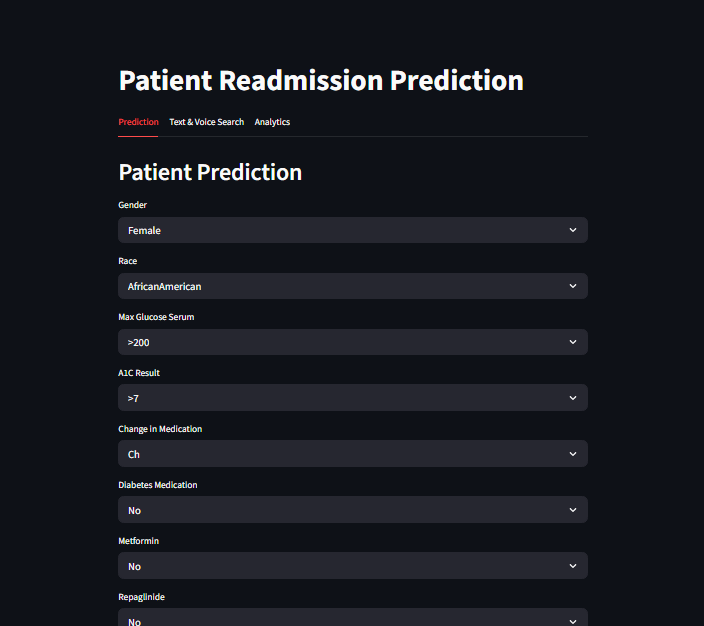
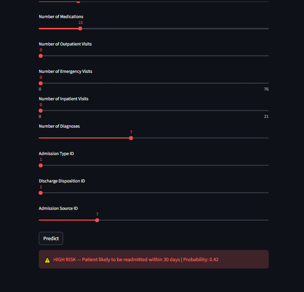
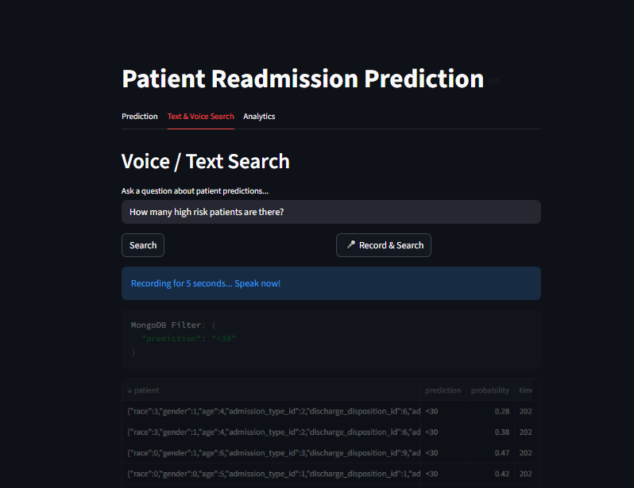
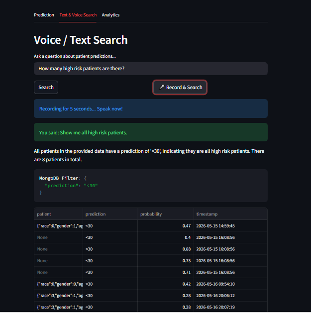
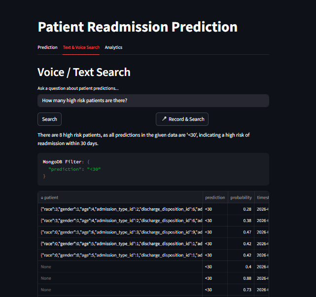
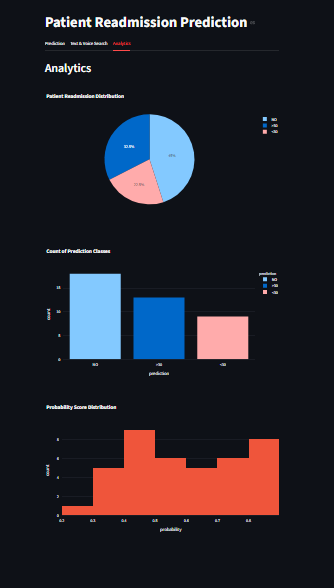
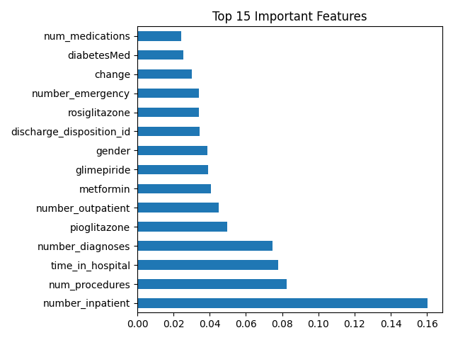

# 🏥 Patient Readmission Prediction System

An end-to-end machine learning system that predicts whether a diabetic patient will be readmitted to hospital within 30 days, after 30 days, or not at all — using the **Diabetes 130-US Hospitals dataset** (101,766 records).

## Tech Stack

- **PostgreSQL** — Raw data storage
- **Python** — Data preprocessing and model training
- **PyTorch** — ANN model training
- **XGBoost** — Final production model
- **FastAPI** — REST API for serving predictions
- **MongoDB Atlas** — Logging prediction results
- **Groq LLaMA 3.3 70B** — Natural language query engine
- **Groq Whisper API** — Speech-to-text transcription
- **Streamlit** — Interactive 3-tab frontend
- **Plotly** — Analytics visualizations

## Architecture

PostgreSQL → preprocess.py → compare_models.py → XGBoost + Threshold Tuning → FastAPI → MongoDB → Streamlit

- **PostgreSQL** — Stores raw patient data (101,766 records, 50 columns)
- **preprocess.py** — Cleans, encodes, scales, applies SMOTE
- **compare_models.py** — Trains and compares ANN, LR, RF, XGBoost
- **FastAPI** — Serves predictions via REST API endpoints
- **MongoDB** — Logs every prediction with patient data and timestamp
- **Streamlit** — 3-tab UI: Prediction Form | Voice & Text Search | Analytics

## Project Structure

```
patient-readmission/
├── model/
│   ├── preprocess.py
│   ├── train.py
│   ├── compare_models.py
│   ├── xg_model.pkl
│   ├── scaler.pkl
│   └── target_encoder.pkl
├── api/
│   └── main.py
├── app/
│   ├── app.py
│   └── seed_mongo.py
├── Screenshots/
│   ├── Patient-Prediction-UI.png
│   ├── Patient-Prediction-Results.png
│   ├── Speech-To-MongoDB-Testing.png
│   ├── Speech-To-MongoDB-Results.png
│   ├── Text-to-MongoDB.png
│   └── Analytics-Tab.png
├── feature_importance.png
├── .gitignore
└── README.md
```

## Model Performance

| Model | Class 0 Recall | Accuracy |
|-------|---------------|----------|
| ANN (PyTorch, 1000 epochs) | 0.29 | 52% |
| Logistic Regression | 0.35 | 48% |
| Random Forest (n=100) | 0.42 | 48% |
| **XGBoost + Threshold Tuning** | **0.45** | **50%** |

**Chosen Model: XGBoost at decision threshold 0.20**

**Most important metric: Class `<30` Recall** — missing a high-risk patient is more dangerous than a false alarm.

### Why is recall low?

This is a known dataset limitation confirmed by published research:

> *XGBoost achieved the highest AUC-ROC of 0.667... DNNs demonstrated the highest recall for the positive class of only 0.143* — PMC 2025 (NCBI)

Our threshold-tuned XGBoost achieves **Class 0 Recall of 0.45**, outperforming the published DNN result of 0.143 on the same dataset.

### Key Findings

- **SMOTE vs Class Weights** — redundant. SMOTE already balances training data to 43,843 per class. `class_weight='balanced'` has zero additional effect.
- **Threshold Tuning** — lowering Class 0 decision threshold from default to 0.20 was the most effective technique, improving recall from 0.08 → 0.45.
- **Feature Importance** — `number_inpatient` (0.16) is the strongest predictor. 10 medication columns had zero importance and were removed.

## Screenshots

### Patient Prediction Form

[](Screenshots/Patient-Prediction-UI.png)

### Prediction Results

[](Screenshots/Patient-Prediction-Results.png)

### Voice Search

[](Screenshots/Speech-To-MongoDB-Testing.png)

[](Screenshots/Speech-To-MongoDB-Results.png)

### Text Search

[](Screenshots/Text-to-MongoDB.png)

### Analytics Dashboard

[](Screenshots/Analytics-Tab.png)

### Feature Importance

[](feature_importance.png)

## API Endpoints

| Method | Endpoint | Description |
|--------|----------|-------------|
| POST | `/predict` | Submit patient data, get readmission prediction |
| GET | `/history` | Retrieve all past predictions from MongoDB |
| GET | `/health` | API health check |

## Tab 2 — Voice & Text Search

Doctors can ask natural language questions about patient predictions:

- *"Show me high risk patients"*
- *"How many patients have probability above 0.7?"*
- *"Show moderate risk patients"*

Uses two Groq LLaMA calls:
1. **Filter generation** — converts question to MongoDB filter JSON
2. **Natural language answer** — summarizes filtered results

Displays the answer, the MongoDB filter used, and a filtered dataframe.

### Note on Whisper

Local OpenAI Whisper was too heavy for Streamlit's connection timeout. Switched to **Groq's Whisper API** (`whisper-large-v3`) — audio is recorded locally via `sounddevice`, converted to WAV, and sent to Groq for transcription. Same model, runs on Groq's GPU instead of local CPU.

## How to Run Locally

1. Clone the repository
```bash
git clone https://github.com/MohomedShajith/Patient-Readmission-Prediction.git
cd Patient-Readmission-Prediction
```

2. Create and activate virtual environment
```bash
python -m venv env
env\Scripts\activate
```

3. Install dependencies
```bash
pip install -r requirements.txt
```

4. Create a `.env` file in the project root
```env
DB_USER=your_postgres_user
DB_PASSWORD=your_postgres_password
DB_HOST=localhost
DB_PORT=5432
DB_NAME=patientdb
MONGO_URI=your_mongodb_connection_string
GROQ_API_KEY=your_groq_api_key
```

5. Run preprocessing and model training
```bash
python model/preprocess.py
python model/compare_models.py
```

6. Start FastAPI
```bash
uvicorn api.main:app --reload
```

7. Start Streamlit
```bash
streamlit run app/app.py
```

## Related Projects

- [Customer Churn Prediction](https://github.com/MohomedShajith/churn-prediction-system)
- [Financial Fraud Detection](https://github.com/MohomedShajith/Financial-Fraud-Detection-System)
- [AI Text-to-SQL Converter](https://github.com/MohomedShajith/Text-to-SQL-Converter)
- [Real Time Stock Dashboard](https://github.com/MohomedShajith/Real-Time-Stock-Dashboard)
